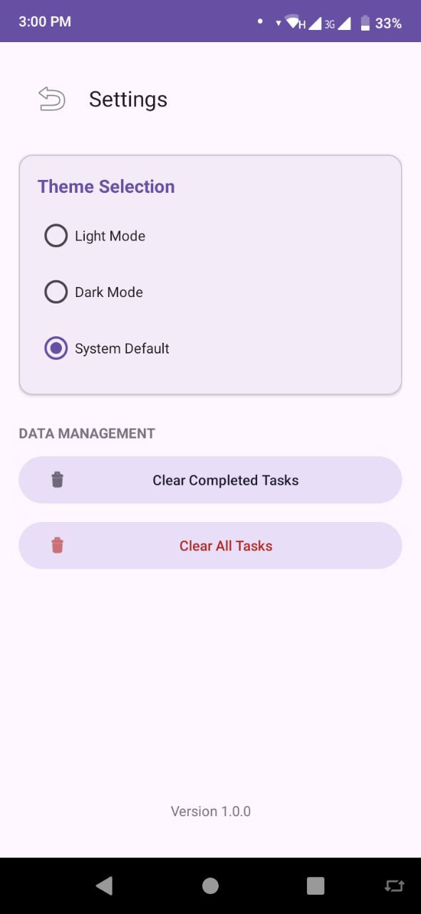

# 📱 UniLife Tasks (To-Do App)

**UniLife Tasks** is a modern, professional Android application designed specifically for university students to manage their daily academic and personal routines. Built with a "Mobile-First, Offline-Sync" architecture, it ensures your schedule is always accessible, whether you're in a basement lecture hall or connected to campus Wi-Fi.

---

## 📷 Screenshots

### 🚀 Splash Screen

### 📋 Task List

### ➕ Add Task

### ⚙️ Settings

---

## 🚀 Key Features

### 📅 Smart Task Management
- **Quick-Add:** Seamlessly create tasks using a modern Material 3 bottom sheet.
- **Academic Integration:** Specialized categories for *Academic*, *Study*, *Health*, and *Spiritual* activities.
- **Priority Matrix:** Categorize tasks by High, Medium, or Low priority with visual color-coding.
- **Precision Scheduling:** Set specific due dates and times for every assignment.

### 🔍 Advanced Productivity Tools
- **Real-time Search:** Instantly filter through your long list of assignments and tasks.
- **Dynamic Sorting:** Organize your view by **Priority** to focus on what matters, or by **Date** to manage your timeline.
- **Swipe Actions:** Intuitive swipe-to-delete and swipe-to-edit functionality for rapid list management.

### 🌓 Personalization & Settings
- **Theme Engine:** Full support for **Light Mode**, **Dark Mode**, and **System Default** via a dedicated Settings screen.
- **Data Management:** Options to bulk-clear completed tasks or reset your entire schedule.

### ☁️ Enterprise-Grade Backend
- **Hybrid Storage:** Uses **SQLite** for lightning-fast offline access and **Firebase Realtime Database** for cloud backup and multi-device synchronization.

---

## 🛠️ Technology Stack

- **Language:** Java (Android SDK)
- **Architecture:** Local-First with Cloud Sync
- **UI/UX:** Material Design 3 (M3) Components
- **Local Database:** SQLite (OpenHelper)
- **Cloud Database:** Firebase Realtime Database
- **UI Elements:** RecyclerView, BottomSheetDialogFragment, SearchView, CardView

---

## 🏗️ Project Structure

- `com.yonas.to_dolist.Adapter`: Manages the complex task list rendering and filtering logic.
- `com.yonas.to_dolist.Model`: Contains the `ToDoModel` data structure.
- `com.yonas.to_dolist.Utils`: Houses `DataBaseHelper` for SQLite and Firebase synchronization.
- `com.yonas.to_dolist.SettingsActivity`: Controls theme switching and bulk data operations.

---

## 👤 Author

- **Yonas J.**

---

📌 *Note: This project was developed as an academic assignment focused on building robust, real-world Android applications with cloud integration.*
